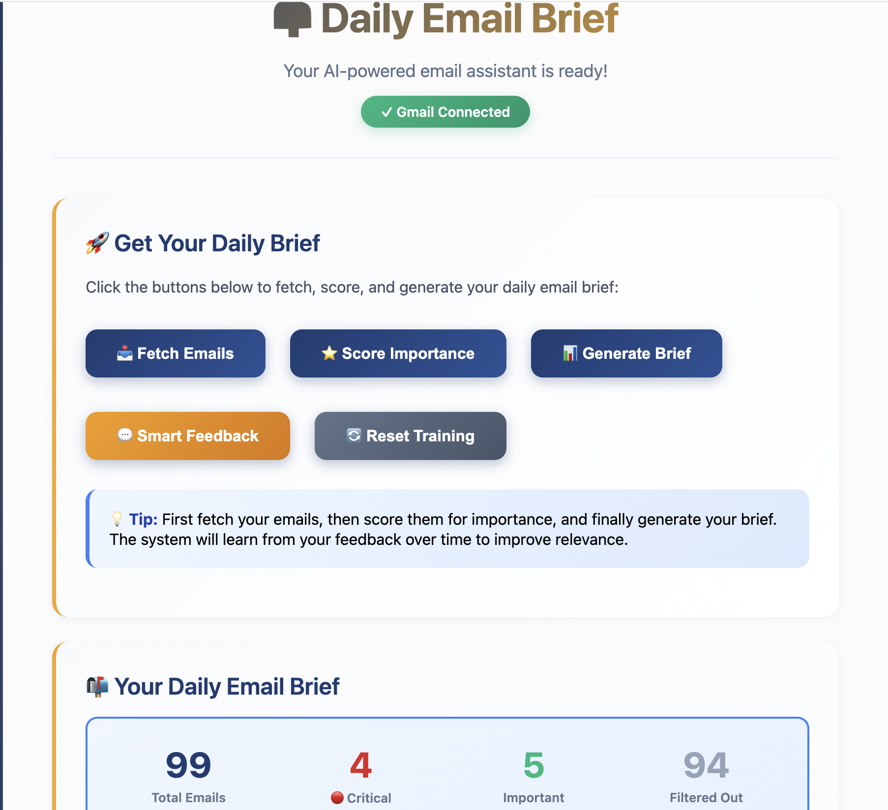
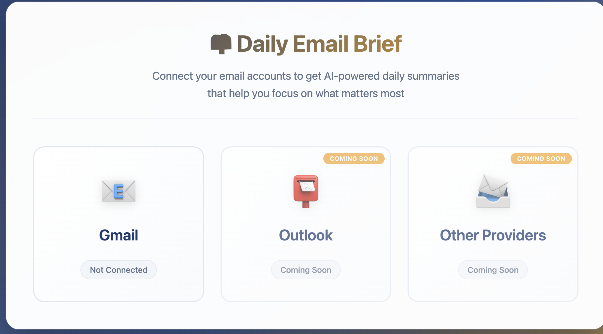
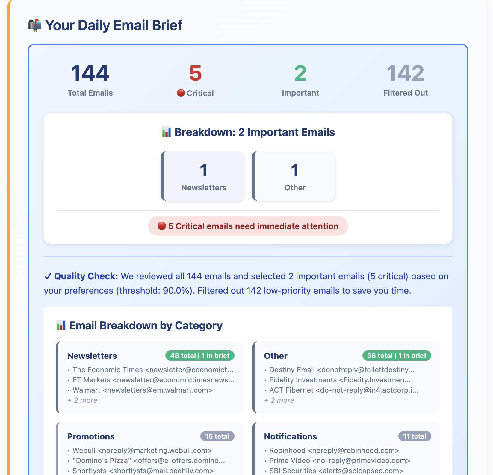

# 📬 Daily Email Brief

> **Stop drowning in your inbox. Get AI-powered email summaries that help you focus on what matters.**

Daily Email Brief is an intelligent email assistant that learns your preferences and delivers personalized daily summaries. **No more opening Gmail/Outlook to check every email** - get the gist instantly and only log in when you need to respond.

## 🎯 The Problem It Solves

**How much time do you spend checking emails every day?**

- 📧 Opening Gmail/Outlook multiple times a day
- 🔍 Scanning through dozens of emails to find what's important
- ⏰ Wasting time on newsletters, promotions, and low-priority messages
- 😰 Missing critical emails buried in the noise
- 🔄 Constantly switching between email and work

**Daily Email Brief solves this by:**
- ✅ **AI-powered importance scoring** - Automatically identifies what matters to YOU
- ✅ **Personalized daily summaries** - Get the gist without opening your inbox
- ✅ **Learns from your feedback** - Gets smarter over time
- ✅ **Beautiful web dashboard** - View everything in one place
- ✅ **Only open email when needed** - Respond only to what requires action

## 💡 Value Proposition

### Before Daily Email Brief
```
┌─────────────────────────────────────────────────┐
│  Traditional Email Management                  │
├─────────────────────────────────────────────────┤
│                                                 │
│  Morning Routine:                               │
│  1. Open Gmail → 50 new emails                 │
│  2. Scan through all 50 emails                 │
│  3. Read subject lines, previews               │
│  4. Open important ones                        │
│  5. Mark/delete unimportant ones               │
│  6. Repeat 3-5 times throughout the day        │
│                                                 │
│  ⏱️ Time spent: 30-60 minutes/day              │
│  😰 Stress: High (email overload)              │
│  📧 Efficiency: Low (manual scanning)          │
└─────────────────────────────────────────────────┘
```

### With Daily Email Brief
```
┌─────────────────────────────────────────────────┐
│  AI-Powered Email Management                   │
├─────────────────────────────────────────────────┤
│                                                 │
│  Morning Routine:                               │
│  1. Open Daily Email Brief dashboard           │
│  2. Read AI-generated summary (2 minutes)      │
│  3. See top 10 important emails with context   │
│  4. Click to view details if needed            │
│  5. Only open Gmail to respond                 │
│                                                 │
│  ⏱️ Time saved: 25-50 minutes/day              │
│  😊 Stress: Low (clear priorities)             │
│  📧 Efficiency: High (AI-powered)              │
└─────────────────────────────────────────────────┘
```

**That's 2-4 hours saved per week!** 🎉

### Visual Comparison

```
Traditional Approach          Daily Email Brief
───────────────────          ──────────────────
📧 Open Gmail                📊 Open Dashboard
   ↓                             ↓
👀 Scan 50 emails            🤖 AI shows top 10
   ↓                             ↓
⏰ 30-60 min/day             ⏰ 2-5 min/day
   ↓                             ↓
😰 High stress               😊 Low stress
   ↓                             ↓
🔄 Repeat 3-5x/day           ✅ Done once
```

## ✨ Key Features

### 🧠 **AI-Powered Intelligence**
- **Smart Importance Scoring** - Uses embeddings and machine learning to score email importance
- **Learns Your Preferences** - The more you use it, the better it gets
- **Sender Reputation** - Remembers which senders are important to you
- **Category Detection** - Automatically categorizes emails (work, personal, urgent, etc.)

### 📊 **Personalized Daily Briefs**
- **Top Priority Emails** - See the most important emails first
- **Context-Rich Summaries** - AI-generated summaries with key points
- **Statistics & Insights** - Understand your email patterns
- **Category Breakdown** - See what types of emails you received

### 🎯 **Smart Onboarding**
- **Guided Setup** - Step-by-step OAuth configuration
- **Email Training** - Review sample emails to teach the AI your preferences
- **Flexible Preferences** - Configure important senders, categories, and priorities
- **All in Web UI** - No command-line configuration needed

### 🌐 **Beautiful Web Interface**
- **Modern Dashboard** - Clean, intuitive interface
- **One-Click Actions** - Fetch, score, and generate briefs with buttons
- **Email Management** - View, filter, and provide feedback on emails
- **No Gmail/Outlook Needed** - Everything accessible from the dashboard

### 🔄 **Multiple Delivery Options**
- **Web Dashboard** - View briefs in your browser
- **Email Delivery** - Receive briefs via email (optional)
- **CLI Access** - Command-line interface for power users
- **All Your Choice** - Use one or all methods

## 🖼️ Visual Overview

### Main Dashboard

*Your command center - see everything at a glance without opening Gmail*

### Email Importance Scoring

*AI automatically scores each email based on your preferences*

### Daily Brief Preview

*Concise, actionable summary of what needs your attention*

---

## 🚀 Quick Start

### Prerequisites
- Python 3.8+
- OpenAI API key ([Get one here](https://platform.openai.com/api-keys))
- Gmail account (Outlook support coming soon)

### Installation

1. **Clone the repository**
   ```bash
   git clone https://github.com/yourusername/daily-email-brief.git
   cd daily-email-brief
   ```

2. **Create virtual environment**
   ```bash
   python3 -m venv venv
   source venv/bin/activate  # On Windows: venv\Scripts\activate
   ```

3. **Install dependencies**
   ```bash
   pip install -r requirements.txt
   ```

4. **Set up OpenAI API key**
   ```bash
   # Create .env file
   echo "OPENAI_API_KEY=your_openai_api_key_here" > .env
   ```

5. **Run the application**
   ```bash
   python main.py
   ```
   
   The web UI will open automatically in your browser! 🎉

### First-Time Setup

The web UI guides you through everything:

1. **Connect Gmail** - OAuth setup with step-by-step instructions
2. **Train the AI** - Review 10 sample emails to teach preferences
3. **Configure Preferences** (optional) - Set important senders, categories
4. **Start Using** - Fetch, score, and generate your first brief!

**That's it!** No complex configuration needed.

## 📖 Usage

### Daily Workflow

Once set up, your daily workflow is simple:

1. **Open Dashboard** - `http://127.0.0.1:5000/dashboard`
2. **Click "Fetch Emails"** - Retrieves emails from last 48 hours
3. **Click "Score Importance"** - AI scores each email
4. **Click "Generate Brief"** - Get your personalized summary
5. **Review & Act** - See what needs attention, only open Gmail to respond

### Web Dashboard Features

- **📥 Fetch Emails** - Get latest emails from your inbox
- **⭐ Score Importance** - AI-powered importance scoring
- **📊 Generate Brief** - Create personalized daily summary
- **💬 Provide Feedback** - Mark emails as important/not important
- **📧 View All Emails** - Browse with importance scores
- **📈 Statistics** - See email patterns and insights

### Advanced Features

#### Important Senders
Configure senders that should always be marked important:
- Specific emails: `boss@company.com`
- Domain patterns: `*@family.com`
- Set priority levels and categories

#### Email Categories
Automatically categorizes emails:
- Work/Professional
- Personal
- Urgent/Security Alerts
- Newsletters
- Promotions
- Notifications

#### Feedback System
- **Interactive Feedback** - Mark emails with categories and priorities
- **Batch Feedback** - Review multiple emails quickly
- **Learning System** - AI improves from your feedback

## 📸 Screenshots & Visual Guide

> **Note:** Screenshots are placeholders. Add actual screenshots to `docs/screenshots/` directory. See `docs/SCREENSHOTS.md` for guide.

## 🎨 Screenshots & Demo

### 📊 Dashboard View
The main dashboard provides a clean, intuitive interface to manage all your emails:


*Main dashboard with daily brief, email list, and action buttons*

**Features shown:**
- Daily brief with top important emails
- All emails sorted by importance with scores
- Statistics and insights panel
- One-click actions: Fetch, Score, Generate Brief
- Quick feedback buttons for each email

### 🎯 Onboarding Flow
Step-by-step setup process:


*Guided onboarding with OAuth setup and email training*

**Steps:**
1. **OAuth Setup** - Clear instructions for Gmail API credentials
2. **Email Training** - Review sample emails to teach AI your preferences
3. **Preferences** - Configure important senders and delivery options

### 📧 Email Training Interface

*Interactive email training - mark emails as important/not important*

### ⚙️ Preferences Configuration

*Configure important senders, categories, and delivery methods*

### 📬 Daily Brief Example

*AI-generated daily brief with top important emails*

---

## 📐 Architecture & Flow Diagram

### System Architecture
```
┌─────────────────────────────────────────────────────────────┐
│                    Daily Email Brief                         │
├─────────────────────────────────────────────────────────────┤
│                                                               │
│  ┌──────────────┐      ┌──────────────┐      ┌────────────┐ │
│  │   Gmail API  │─────▶│  Email Fetch │─────▶│  Database  │ │
│  │  (OAuth 2.0) │      │   Connector  │      │  (SQLite)  │ │
│  └──────────────┘      └──────────────┘      └────────────┘ │
│                                                               │
│         │                           │                        │
│         ▼                           ▼                        │
│  ┌──────────────┐      ┌──────────────┐                     │
│  │ AI Scorer    │      │ AI Summarizer│                     │
│  │ (Embeddings) │      │  (GPT-4)     │                     │
│  └──────────────┘      └──────────────┘                     │
│         │                           │                        │
│         └───────────┬───────────────┘                        │
│                     ▼                                        │
│              ┌──────────────┐                                │
│              │   Dashboard  │                                │
│              │  (Web UI)    │                                │
│              └──────────────┘                                │
│                                                               │
└─────────────────────────────────────────────────────────────┘
```

### User Flow
```
Start: python main.py
    │
    ▼
┌─────────────────┐
│  Web UI Opens   │
└────────┬────────┘
         │
         ▼
┌─────────────────┐
│  OAuth Setup    │───▶ Connect Gmail
└────────┬────────┘
         │
         ▼
┌─────────────────┐
│  Email Training │───▶ Review 10 sample emails
└────────┬────────┘
         │
         ▼
┌─────────────────┐
│  Preferences    │───▶ (Optional) Configure settings
└────────┬────────┘
         │
         ▼
┌─────────────────┐
│   Dashboard     │───▶ Main hub: Fetch, Score, Brief
└─────────────────┘
```

### Daily Workflow
```
Morning Routine:
    │
    ├─▶ Fetch Emails ────▶ Get latest from Gmail
    │
    ├─▶ Score Importance ─▶ AI scores each email
    │
    ├─▶ Generate Brief ───▶ Get personalized summary
    │
    └─▶ Review & Act ─────▶ Only open Gmail to respond
```

---

**Note:** Screenshots should be added to `docs/screenshots/` directory. See `docs/SCREENSHOTS.md` for screenshot guide and specifications.

### Quick Visual Flow
```
User Action                    System Response
─────────────                  ───────────────
Click "Fetch"          ────▶  Retrieves emails from Gmail
                                ↓
Click "Score"          ────▶  AI analyzes & scores importance
                                ↓
Click "Generate Brief" ────▶  Creates personalized summary
                                ↓
Review Brief           ────▶  See what needs attention
                                ↓
Open Gmail (if needed) ────▶  Only for emails requiring response
```

**Result:** 90% of email checking time eliminated! ⚡

## 💰 Time Savings Calculator

**Average user saves:**
- **25-50 minutes per day** checking emails
- **2-4 hours per week**
- **8-16 hours per month**
- **96-192 hours per year**

**That's 2-4 weeks of work time saved annually!** ⏰

## 🔒 Privacy & Security

- **100% Local** - All data stays on your computer
- **Read-Only Access** - Only requests read permission for emails
- **No Cloud Storage** - Emails stored locally in SQLite database
- **Open Source** - Full transparency, you control your data

## 🛠️ Technical Details

### Built With
- **Python 3.8+** - Core language
- **Flask** - Web framework
- **OpenAI API** - AI-powered scoring and summarization
- **Gmail API** - Email fetching
- **SQLite** - Local data storage
- **Click** - CLI interface

### Architecture
- **Modular Design** - Easy to extend and customize
- **AI Scoring Engine** - Embeddings-based importance scoring
- **Feedback Learning** - Continuous improvement from user input
- **Web-First** - Beautiful UI for all operations

## 📋 Requirements

See `requirements.txt` for full list. Key dependencies:
- `openai>=1.12.0` - AI capabilities
- `flask==3.0.0` - Web framework
- `google-api-python-client==2.108.0` - Gmail integration
- `click==8.1.7` - CLI interface

## 🤝 Contributing

Contributions are welcome! Please feel free to submit a Pull Request.

## 📝 License

This project is open source and available under the MIT License.

## 🙏 Acknowledgments

- OpenAI for powerful AI capabilities
- Google for Gmail API
- All contributors and users

## 📞 Support

- **Issues**: [GitHub Issues](https://github.com/yourusername/daily-email-brief/issues)
- **Discussions**: [GitHub Discussions](https://github.com/yourusername/daily-email-brief/discussions)

## 🗺️ Roadmap

- [ ] Outlook/Exchange support
- [ ] Email delivery of briefs
- [ ] Mobile app
- [ ] Browser extension
- [ ] Scheduled briefs (cron jobs)
- [ ] Team/organization features
- [ ] Advanced filtering rules
- [ ] Integration with calendar

## ⭐ Why This Project Matters

**Email overload is a real problem.** The average knowledge worker receives 100+ emails per day and spends 2-3 hours managing them. Most of these emails are:
- Newsletters you subscribed to but don't read
- Promotional emails from stores
- Automated notifications
- Low-priority updates

**Daily Email Brief helps you:**
- ✅ **Focus on what matters** - See important emails first
- ✅ **Save time** - No need to open Gmail/Outlook constantly
- ✅ **Never miss critical emails** - AI ensures important messages surface
- ✅ **Reduce email anxiety** - Know what needs attention at a glance
- ✅ **Work more efficiently** - Spend time on work, not email management

**Start reclaiming your time today!** 🚀

---

**Made with ❤️ to help you focus on what matters**
